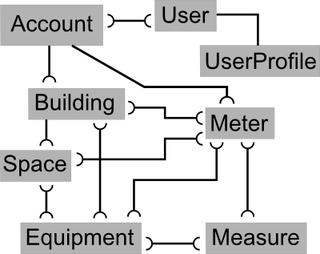

.. _primary_models:

***************
Primary Models
***************

Overview
========

The primary models and their relationships are shown in the following figure.

The :class:`~django.contrib.auth.models.User` is Django's built-in model, and the :class:`~BuildingSpeakApp.models.UserProfile` simply extends that model allowing custom fields to be connected to each :file:`User`, such as :file:`mobile_phone`.  Each :file:`User` may be connected to any number of :file:`Accounts`, and it is this relationship which defines what a :file:`User` can access in BuildingSpeak.  Future versions may connect :file:`Users` to lower-level models.

An :class:`~BuildingSpeakApp.models.Account` is the top-level object in the BuildingSpeak universe.  Generally it will represent an organization, although there may be situations which call for multiple :file:`Accounts` to be created for one customer or organization.  :file:`Buildings` and :file:`Meters` are one-to-one with an :file:`Account` and represent what you'd expect: real world buildings and real world utility meters.

A :class:`~BuildingSpeakApp.models.Meter` is a device that records the flow of some substance of interest, e.g. electricity, natural gas, and domestic water.  All fuel types supported by ENERGY STAR's Portfolio Manager are supported by BuildingSpeak, along with domestic water (not considered a fuel).  Generally, :file:`Meters` are provided by a utility company and are the basis for the billing that utility provides to its customer.  However, larger commercial and institutional customers may have some of their own :file:`Meters` which they read and maintain themselves.

:file:`Meters` receive a flow from a utility company or some local source, and the building's pipes and wires then distribute those flows to the :class:`~BuildingSpeakApp.models.Equipment` that consume it in order to provide some useful function such as lighting, heating, or cooling.  BuildingSpeak allows many-to-many relationships between :file:`Meters` and :file:`Equipment` in order to model real world scenarios.  For example, one natural gas :file:`Meter` may serve multiple rooftop units (pieces of :file:`Equipment`) for heating, but each of those rooftop units also receive electricity from an electric :file:`Meter`.

A :class:`~BuildingSpeakApp.models.Building` is actually quite an abstract object in BuildingSpeak, because :file:`Buildings` don't directly influence the consumption of energy and water, i.e. the :file:`Building` itself does not consume anything.  The energy and water can be thought of as entering and leaving the building through various 'pipes' that penetrate a building's envelope.  These pipes connect directly to :file:`Equipment`, which are the actual consumers of energy and water.  Thus :file:`Buildings` are more of a boundary grouping together a set of :file:`Meters` and :file:`Equipment`.  They do, of course, have an impact on utility consumption due to their interaction with the outdoor environment, but this impact can only be seen via the consumption of :file:`Equipment` and the :file:`Meters` which serve them.

A :class:`~BuildingSpeakApp.models.Space` is a subunit of a :file:`Building` with very similar attributes and functionality.  It links one-to-one with :file:`Buildings` and many-to-many with :file:`Equipment` and :file:`Meters`.

An :class:`~BuildingSpeakApp.models.EfficiencyMeasure` represents a conservation measure (the term 'energy' is avoided because :file:`Measures` may involve domestic water or other non-energy utilities) adopted by building owners to improve the efficiency of their building's operation or to reduce consumption.  Because they deal directly with changes in utility consumption, they attach directly only to :file:`Meters` and :file:`Equipment`.  

User
====
.. autoclass:: django.contrib.auth.models.User
    :members:

UserProfile
===========
.. autoclass:: BuildingSpeakApp.models.UserProfile
    :members:

Account
=======
.. autoclass:: BuildingSpeakApp.models.Account
    :members:

Building
========
.. autoclass:: BuildingSpeakApp.models.Building
    :members:

Meter
=====
.. autoclass:: BuildingSpeakApp.models.Meter
    :members:

Space
=====
.. autoclass:: BuildingSpeakApp.models.Space
    :members:

Equipment
=========
.. autoclass:: BuildingSpeakApp.models.Equipment
    :members:

Measure
=======
.. autoclass:: BuildingSpeakApp.models.EfficiencyMeasure
    :members:
